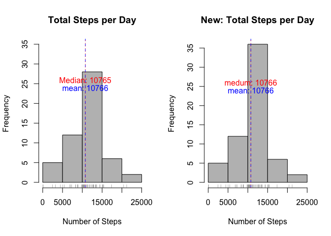

# Reproducible Research: Peer Assessment 1


## Loading and preprocessing the data

```r
dataset <- "https://d396qusza40orc.cloudfront.net/repdata%2Fdata%2Factivity.zip"
download.file(dataset, "activity.zip", method="curl")
unzip("activity.zip") 
dat <- read.csv("activity.csv")
```


## What is mean total number of steps taken per day?

```r
# Ignore missing values
dailyData <-  aggregate(steps~date, data=dat, sum, na.rm=TRUE)
dailyMeanStep <- mean(dailyData$steps)
dailyMedianStep <- median(dailyData$steps)
hist(dailyData$steps, main="Total Steps per Day", xlab="Number of Steps", col="gray80")
rug(dailyData$steps, col="gray50")
abline(v= dailyMeanStep, lty=2, col="blue")
abline(v= dailyMedianStep, lty=3, col="red")
text(dailyMeanStep,22,labels=paste("mean:", round(dailyMeanStep)), pos=3, col="blue")
text(dailyMedianStep,24,labels=paste("Median:", round(dailyMedianStep)), pos=3, col="red")
```

 

```r
summary(dailyData)
```

```
##          date        steps      
##  2012-10-02: 1   Min.   :   41  
##  2012-10-03: 1   1st Qu.: 8841  
##  2012-10-04: 1   Median :10765  
##  2012-10-05: 1   Mean   :10766  
##  2012-10-06: 1   3rd Qu.:13294  
##  2012-10-07: 1   Max.   :21194  
##  (Other)   :47
```
From the histogram above, we can tell that:  
The **Mean** total number of steps taken per day is **10766**.  
The **Median** total number of steps taken per day is **10765**.  


## What is the average daily activity pattern?

```r
# Ignore missing values
dailyActivity <- aggregate(steps~interval, data=dat, mean, na.rm=TRUE)
dailyMaxActivity <- max(dailyActivity$steps)
intervalMaxActivity <- dailyActivity[which.max(dailyActivity$steps),]$interval
plot(dailyActivity, type="l", main="Average Steps per day", xlab="Interval Index", ylab="Average Steps taken across the days", col="gray50")
abline(v= intervalMaxActivity, lty=2, col="blue")
abline(h= round(dailyMaxActivity), lty=2, col="blue")
text(intervalMaxActivity, 195,labels=paste("max steps:", round(dailyMaxActivity)), pos=4, col="blue")
text(intervalMaxActivity, 180,labels=paste("interval index:", intervalMaxActivity), pos=4, col="blue")
```

 

Index: 835 (5-minute) interval, on average across all the days in the dataset, contains the maximum value of 206 number of steps.
 

## Imputing missing values

```r
# Calculate total missing values in the dataset
completeData <- dat[complete.cases(dat),]
incompleteData <- dat[!complete.cases(dat),]
```
Total missing values in dataset: 2304.  
Total complete values in dataset: 15264.


```r
# Plot 2 charts: original and modified with replaced missing values
par(mfrow=c(1,2))

dailyData <-  aggregate(steps~date, data=dat, sum, na.rm=TRUE)
dailyMeanStep <- mean(dailyData$steps)
dailyMedianStep <- median(dailyData$steps)
hist(dailyData$steps, main="Total Steps per Day", xlab="Number of Steps", ylim=c(0,35), col="gray")
rug(dailyData$steps, col="gray50")
abline(v= dailyMeanStep, lty=2, col="blue")
abline(v= dailyMedianStep, lty=3, col="red")
text(dailyMeanStep,22,labels=paste("mean:",round(dailyMeanStep)), pos=3, col="blue")
text(dailyMedianStep,24,labels=paste("Median:", round(dailyMedianStep)), pos=3, col="red")

# Replace NA values with the average values from the interval
for(i in 1:nrow(dat)){
  if(is.na(dat[i,]$step))
    dat[i,]$steps <- dailyActivity[dailyActivity$interval==(dat[i,]$interval),]$steps
}
newDailyData <-  aggregate(steps~date, data=dat, sum)
newDailyMeanStep <- mean(newDailyData$steps)
newDailyMedianStep <- median(newDailyData$steps)
hist(newDailyData$steps, main="New: Total Steps per Day", xlab="Number of Steps", col="gray")
rug(newDailyData$steps, col="gray50")
abline(v= newDailyMeanStep, lty=2, col="blue")
abline(v= newDailyMedianStep, lty=3, col="red")
text(newDailyMeanStep,22,labels=paste("mean:",round(newDailyMeanStep)), pos=3, col="blue")
text(newDailyMedianStep,24,labels=paste("medum:",round(newDailyMedianStep)), pos=3, col="red")
```

 

The **Mean** total number of steps taken per day is **10766**.  
The **Median** total number of steps taken per day is **10765**.  


```r
summary(dailyData) 
```

```
##          date        steps      
##  2012-10-02: 1   Min.   :   41  
##  2012-10-03: 1   1st Qu.: 8841  
##  2012-10-04: 1   Median :10765  
##  2012-10-05: 1   Mean   :10766  
##  2012-10-06: 1   3rd Qu.:13294  
##  2012-10-07: 1   Max.   :21194  
##  (Other)   :47
```

```r
summary(newDailyData) 
```

```
##          date        steps      
##  2012-10-01: 1   Min.   :   41  
##  2012-10-02: 1   1st Qu.: 9819  
##  2012-10-03: 1   Median :10766  
##  2012-10-04: 1   Mean   :10766  
##  2012-10-05: 1   3rd Qu.:12811  
##  2012-10-06: 1   Max.   :21194  
##  (Other)   :55
```
Both the **Mean** and **Median** are the same for both charts.  

The impact of replacing the missing data does not change the **Mean** and **Median** of the datasets.  
The only difference is that it has a **higher 1st Quantile** and a **lower 3rd Quantile**.  


## Are there differences in activity patterns between weekdays and weekends?

```r
# Panel 2 plot charts
par(mfrow=c(2,1))

# Convert date variable to date type
dat$date <- as.Date(dat$date, format="%Y-%m-%d")
# Add a day and dayType variable
dat$day <- weekdays(dat$date)
dat$dayType <- "weekday"
# Change dayType to weekend if day variable is a Saturday or Sunday.
for(i in 1:nrow(dat)){
  if(dat[i,]$day %in% c("Saturday", "Sunday"))
    dat[i,]$dayType <- "weekend"
}
dat$dayType <- as.factor(dat$dayType)
newActivityData <- aggregate(steps~interval+dayType, dat, mean)
plot(newActivityData[newActivityData$dayType=="weekday",]$steps , type="l", col="brown", main="Weekday", xlab="intervals", ylab="Steps", ylim=c(1,250))
plot(newActivityData[newActivityData$dayType=="weekend",]$steps, type="l", col="brown", main="Weekend", xlab="intervals", ylab="Steps", ylim=c(1,250) )
```

 
